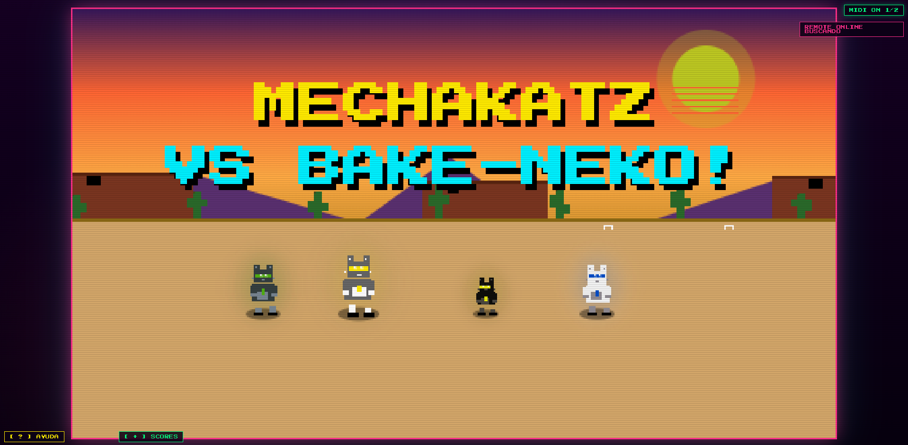

# MechaKatz VS Bake-Neko!

Beat-'em-up de pixel art para una funcion en vivo. De uno a cuatro asistentes controlan MechaKatz mientras la salida principal se muestra en el navegador del anfitrion. Un VJ dirige el show en tiempo real por MIDI o teclado (enemigos, ataques del jefe, avance de etapa, efectos) y todo se ajusta en vivo desde un editor de configuracion dedicado.



## Requisitos

- Navegador moderno basado en Chromium (Chrome/Edge) para Web MIDI y WebRTC.
- Node.js 18 o superior: hub LAN y generador del editor (sin dependencias npm).
- Python 3.11: solo para el servicio online (`online_service/requirements.txt`).
- Conexion a Internet la primera vez para las fuentes de Google Fonts (Press Start 2P y VT323); sin ella el juego funciona con fuentes de respaldo.

## Formas de jugar

El proyecto conserva tres rutas compatibles:

| Perfil | Imagen | Control | Transporte |
| --- | --- | --- | --- |
| Local | Pantalla del anfitrion | Teclado o MIDI | Sin red |
| Telefono LAN | Pantalla del anfitrion; estado en el telefono | Joystick y botones tactiles | WebSocket local, puerto 8765 |
| Telefono online | Estado o video del juego en el telefono | Los mismos controles tactiles | WSS para control y WebRTC para video/audio |

En ambos perfiles de telefono el juego del anfitrion sigue siendo la autoridad: el relay solo autentica sesiones, asigna slots, reenvia entradas y coordina WebRTC.

## Archivos principales

- `mechakatz_vs_kaiju_V9.html`: juego y fuente del panel de configuracion.
- `mobile-controller.html`: cockpit movil para LAN y sesiones online.
- `mecha_remote_hub.js`: hub LAN heredado; no debe exponerse directamente a Internet.
- `online_service/`: orquestador FastAPI para sesiones online autenticadas.
- `build_config_editor.js`: regenera `mechakatz_config.html` desde el juego.
- `mechakatz_config.html`: editor de configuracion **generado**; no se edita a mano.
- `MECHAKATZ.json`: configuracion exportada del show.

## Controles

| Accion | Jugador 1 | Jugador 2 |
| --- | --- | --- |
| Mover | `W` `A` `S` `D` | Flechas |
| Golpe ligero | `F` | `J` |
| Golpe fuerte | `G` | `K` |
| Escudo | `R` | `I` |
| Especial | `T` | `O` |
| Vuelo | `Espacio` | `L` |

Los jugadores 3 y 4 se unen por telefono o MIDI.

Eventos del VJ (nota MIDI en canal 1 / tecla), editables en el editor de configuracion:

| Evento | Nota | Tecla |
| --- | --- | --- |
| Enemigo pequeno / grande / lanzador | 36 / 38 / 40 | `F1` / `F2` / `F3` |
| Oleada | 41 | `F4` |
| Soltar vida | 43 | `F5` |
| Entrada del jefe | 57 | `F6` |
| Laser / fuego / golpe del jefe | 48 / 50 / 52 | `F7` / `F8` / `F9` |
| Segunda cabeza del jefe | 55 | `F10` |
| Flash + temblor | 60 | `F11` |
| Forzar avance | 64 | `\` |
| Entrar a seleccion | 65 | `Enter` |
| Terminar sesion | 67 | `F12` |

## Editor de configuracion

Abre `mechakatz_config.html` en otra ventana del **mismo navegador** que el juego. Cada cambio se guarda en `localStorage` y el juego lo aplica en vivo. Desde el editor tambien se exporta/importa la configuracion como JSON.

Si modificas el codigo del panel dentro del juego, regenera el editor:

```powershell
node .\build_config_editor.js
```

## Ejecucion local

Juego sin telefonos: abre `mechakatz_vs_kaiju_V9.html` en un navegador.

Controladores en la misma red:

```powershell
node .\mecha_remote_hub.js
```

> **Aviso de privacidad:** en Windows el hub detecta la red WiFi y lee su contrasena con `netsh wlan show profile key=clear` para mostrar un QR de conexion. La contrasena queda visible en la pagina del hub para cualquiera en esa red. Si no lo deseas, define `MECHA_WIFI_AUTODETECT=false` o fija una red manual en `start_mecha_remote_hub.bat`.

Controladores mediante el servicio de sesiones:

```powershell
.\start_mecha_online_service.bat
```

El servicio escucha en `0.0.0.0:8787`. El lanzador usa `py -3.11`, `python` o la instalacion local de Python 3.11 (en ese orden), detecta la IPv4 LAN del PC y la anuncia como base de los QR cuando no existe `MECHA_PUBLIC_URL`; deja la ventana abierta mientras juegas. `127.0.0.1` solo sirve desde el mismo PC: si ejecutas Uvicorn manualmente, usa la IP LAN (por ejemplo `http://192.168.x.x:8787`) en `serviceHttpUrl` o define `MECHA_PUBLIC_URL` con esa IP. En el editor de configuracion selecciona el transporte online y conecta el anfitrion. La sala entrega cuatro enlaces de estado y cuatro enlaces de juego transmitido.

Si el celular muestra `ERR_CONNECTION_REFUSED`, revisa primero que el enlace no contenga `127.0.0.1`/`localhost`, que el lanzador siga abierto y que el puerto TCP `8787` este permitido en la red privada de Windows. Si el firewall lo bloquea, abre PowerShell/CMD como administrador y ejecuta: `netsh advfirewall firewall add rule name="MechaKatz Online Service 8787 (Private)" dir=in action=allow protocol=TCP localport=8787 profile=private`. Es una regla local acotada al puerto y perfil privado; no la agregues en redes publicas.

## Publicacion para Internet

La ejecucion publica (fuera de la misma Wi-Fi) requiere un dominio HTTPS, proxy con WebSocket, secretos persistentes y un servidor TURN. Configura `MECHA_PUBLIC_URL=https://...` antes de iniciar el relay; no guardes secretos reales en el repositorio. Sin esa infraestructura solo queda disponible el modo LAN.

El estado de las salas vive en memoria. Ejecuta una sola instancia y un solo worker. Antes de escalar horizontalmente hay que mover sesiones y coordinacion a un almacen compartido.

STUN puede bastar en redes sencillas, pero no atraviesa todas las combinaciones de NAT o firewall. El perfil `Control + estado` funciona enteramente sobre WSS; para afirmar que `Juego transmitido + control` funciona entre redes arbitrarias se debe configurar TURN y probar desde datos celulares.

Consulta [online_service/README.md](online_service/README.md) para el despliegue y las variables.

## Verificacion

```powershell
node .\build_config_editor.js
py -3.11 -m pytest -q
py -3.11 -m uvicorn online_service.app:app --host 127.0.0.1 --port 8787
py -3.11 .\tests\live_relay_smoke.py http://127.0.0.1:8787
```

`tests/test_client_contracts.js` valida sintaxis y contratos compartidos de juego, movil, editor generado y JSON:

```powershell
node .\tests\test_client_contracts.js
```

## Licencia

Distribuido bajo la licencia MIT. Consulta [LICENSE](LICENSE).
